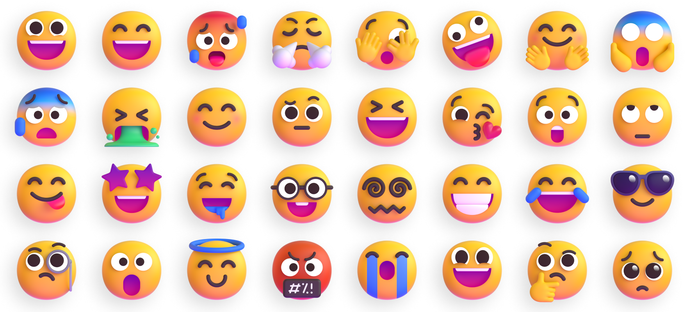

# FluentUI Emoji API 🚀🍀



A robust and powerful API for accessing and searching FluentUI Emoji assets, originally created by [Microsoft](https://github.com/microsoft/fluentui-emoji). This project provides a Flask-based backend to easily query emojis by name, glyph, group, or keywords, and serves high-quality 3D, Color, Flat, and High-Contrast assets.

---

## 🚀 Features

- **Searchable Metadata**: Search emojis by `glyph` (🥇), `keywords`, `cldr` names, or `mappedToEmoticons`.
- **Group Categorization**: List and filter emojis by their official groups (e.g., Smileys & Emotion, Activities, Travel & Places).
- **Asset Serving**: Directly serves PNG (3D) and SVG (Color, Flat, High-Contrast) assets.
- **Dynamic URL Prefixing**: API responses include full, ready-to-use URLs for all assets.
- **Clean Naming**: All asset folders and files are automatically renamed to follow standard URL hyphenation (e.g., `1st-place-medal`).

---

## 🛠️ API Endpoints

### 1. Get All Emojis
Returns a list of all emojis in the collection.
- **URL**: `/api/emojis`
- **Method**: `GET`
- **Example**: `http://localhost:5000/api/emojis`

### 2. Search Emojis
Search for specific emojis using a query string.
- **URL**: `/api/emojis?search=<query>`
- **Method**: `GET`
- **Example**: `http://localhost:5000/api/emojis?search=gold`

### 3. List Groups
Returns all unique emoji group names.
- **URL**: `/api/emojis/group`
- **Method**: `GET`
- **Example**: `http://localhost:5000/api/emojis/group`

### 4. Filter by Group
Returns all emojis belonging to a specific group.
- **URL**: `/api/emojis/group?name=<GroupName>`
- **Method**: `GET`
- **Example**: `http://localhost:5000/api/emojis/group?name=Activities`

---

## 🌐 Live Demo & Hosted API

The API is live and publicly accessible for production use:
**[https://fluentui-emoji-my.netlify.app](https://fluentui-emoji-my.netlify.app)**

### Quick Usage Example (JavaScript)

```javascript
// Fetch all emojis related to 'fire'
async function searchEmoji() {
  const response = await fetch('https://fluentui-emoji-my.netlify.app/api/emojis?search=fire');
  const data = await response.json();
  console.log(`Found ${data.total} emojis:`, data.emojis);
  
  const firstEmoji = data.emojis[0];
  console.log("Emoji Name:", firstEmoji.cldr);
  console.log("3D Asset URL:", firstEmoji.variations["3D"][0]);
}

searchEmoji();
```

### Live Browser Quick Links:
- 🔍 **Search**: [search for 'heart'](https://fluentui-emoji-my.netlify.app/api/emojis?search=heart)
- 📂 **Groups**: [list all unique groups](https://fluentui-emoji-my.netlify.app/api/emojis/group)
- 🏷️ **Filter**: [get 'Smileys & Emotion' group](https://fluentui-emoji-my.netlify.app/api/emojis/group?name=Smileys%20&%20Emotion)

---

## 📄 Example Response

```json
{
  "creator": "Kawdhitha Nirmal",
  "developers": "Cyber Yakku",
  "search": "1st place medal",
  "total": 1,
  "emojis": [
    {
      "cldr": "1st place medal",
      "glyph": "🥇",
      "group": "Activities",
      "keywords": [
        "1st place medal",
        "first",
        "gold",
        "medal"
      ],
      "variations": {
        "3D": [
          "https://fluentui-emoji-my.netlify.app/assets/1st-place-medal/3D/1st_place_medal_3d.png"
        ],
        "Color": [
          "https://fluentui-emoji-my.netlify.app/assets/1st-place-medal/Color/1st_place_medal_color.svg"
        ]
      }
    }
  ]
}
```

---

## 📦 Getting Started

### Prerequisites
- Python 3.x
- Flask

### Installation
1. Clone the repository:
   ```bash
   git clone https://github.com/KAWDHITHA-NIRMAL/fluentui-emoji.git
   cd fluentui-emoji
   ```
2. Install dependencies:
   ```bash
   pip install flask
   ```

### Running the API
1. First, generate the metadata and clean folder names (optional if already provided):
   ```bash
   python metadata.py
   ```
2. Start the Flask server:
   ```bash
   python app.py
   ```
3. The API will be available at `http://localhost:5000`.

---

## 🛠️ Framework Integration (Multi-Platform)

You can easily integrate FluentUI Emojis across your web and mobile applications using our dedicated client libraries.

### 1. Plain HTML / JavaScript
Use the native Web Component to add premium emojis anywhere in your HTML.

```html
<!-- Load the library -->
<script src="https://dev.dubhub.lk/script/fluentui-emojis.js"></script>

<!-- Use the custom tag -->
<fluent-emoji glyph="🚀" style="3D"></fluent-emoji>
<fluent-emoji glyph="🍏" style="Color"></fluent-emoji>
```

### 2. React / Next.js
Install the NPM package and use the built-in React component.

```jsx
import { FluentEmoji } from 'fluentui-emojis';

export default function App() {
  return (
    <div>
      Welcome! <FluentEmoji glyph="🚀" style="3D" />
    </div>
  );
}
```

### 3. Flutter (Mobile & Desktop)
Add the dependency to your `pubspec.yaml` and use the custom `FluentEmoji` widget.

```dart
import 'package:fluent_emojis/widgets/fluent_emoji.dart';

// Display a premium 3D icon
FluentEmoji(
  glyph: '🚀',
  style: '3D',
  size: 32.0,
);
```

---

## ❤️ Credits & Attribution

- **Original Assets**: [FluentUI Emoji](https://github.com/microsoft/fluentui-emoji) by [Microsoft](https://github.com/microsoft/).
- **Creator**: [Kawdhitha Nirmal](https://github.com/KAWDHITHA-NIRMAL)
- **Developers**: [Cyber Yakku](https://github.com/KAWDHITHA-NIRMAL)

---

## 📝 License

This project is open-source. Please refer to the [Microsoft FluentUI Emoji License](https://github.com/microsoft/fluentui-emoji/blob/main/LICENSE) for asset usage rights.
